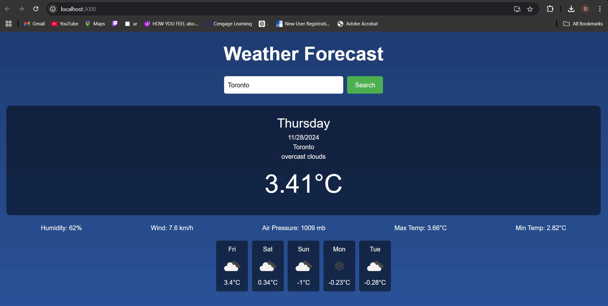
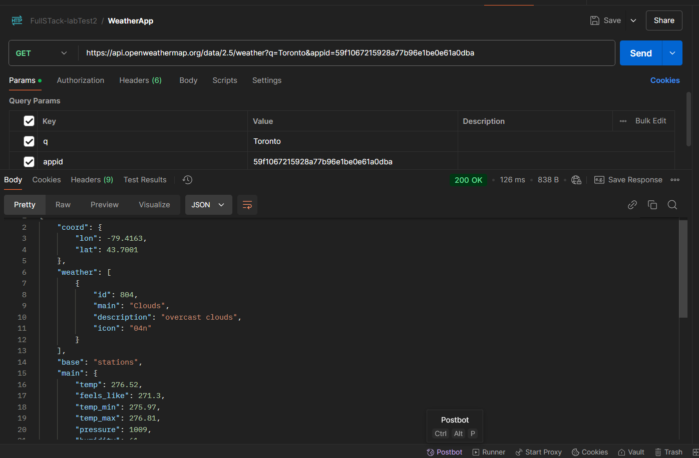

# Weather App 🌦️

## Overview
This is a user-friendly **Weather App** built with ReactJS. It provides real-time weather information for any city using the **OpenWeatherMap API**. Users can view:
- Current weather conditions (temperature, description, etc.)
- Key weather details (humidity, wind speed, pressure, etc.)
- A 5-day weather forecast with icons and daily temperatures.

---

## Features
1. **Search by City:**
   - Enter any city name to fetch weather details dynamically.
2. **Current Weather:**
   - Displays the current weather conditions with:
     - Temperature
     - Humidity
     - Wind speed
     - Air pressure
3. **Weekly Forecast:**
   - Displays the weather forecast for the next 5 days, including daily icons and temperatures.
4. **Modern Design:**
   - Styled with a responsive layout and user-friendly design.

---

## Screenshots

### 2. **Current Weather And Weekly Forecast**



### 3. **Postman**



---

## Technologies Used
- **ReactJS:** Front-end library for building the UI.
- **Axios:** For API calls to OpenWeatherMap.
- **OpenWeatherMap API:** To fetch real-time weather and forecast data.
- **CSS/TailwindCSS:** For styling and layout.

---

## Setup and Installation
1. Clone the repository:
   ```bash
   git clone https://github.com/Daryamn88/101394900_comp3123_labtest2.git
